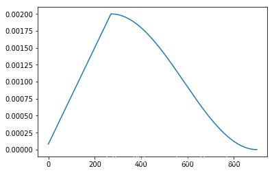
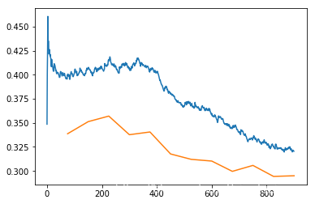

- [ install](#head1)
- [ fit_one_cycle](#head2)
#  install
pip install fastai -i https://pypi.douban.com/simple

#  fit_one_cycle
在学习的过程中逐步增大学习率目的是为了不至于陷入局部最小值，边学习边计算loss。

其次，当loss曲线向上扬即变大的时候，开始减小学习率，慢慢的趋近梯度最小值，loss也会慢慢减小。就如下图：
图为课程中的图

该图x轴为迭代次数，y轴为学习率

该图x轴为迭代次数，y轴为loss

结合两个图可以看出：

学习率首先逐渐变大，loss逐渐变小
当学习率达到训练时给的参数时，开始下降。
随着学习率不断降低，loss也开始降低。
这个算法被称为:learning rate annealing(学习率退火算法)。
