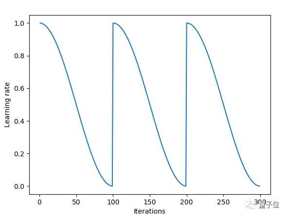
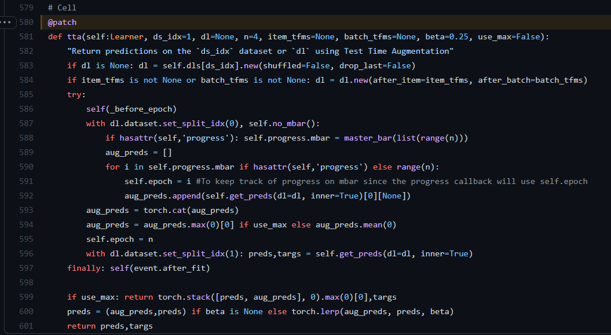

# install
pip install fastai -i https://pypi.douban.com/simple

# Learn.fit_one_cycle(n_epoch)
Fit self.model for n_epoch using the 1cycle policy.
在学习的过程中逐步增大学习率目的是为了不至于陷入局部最小值，边学习边计算loss。

其次，当loss曲线向上扬即变大的时候，开始减小学习率，慢慢的趋近梯度最小值，loss也会慢慢减小。就如下图：
图为课程中的图

该图x轴为迭代次数，y轴为学习率

该图x轴为迭代次数，y轴为loss

结合两个图可以看出：

学习率首先逐渐变大，loss逐渐变小
当学习率达到训练时给的参数时，开始下降。
随着学习率不断降低，loss也开始降低。
这个算法被称为:learning rate annealing(学习率退火算法)。

# Learn.fit_one_cycle() 的重启的余弦退火-超参数调教明细表
fastai开发文档的超参数明细表:https://docs.fast.ai/callback.schedule.html#ParamScheduler  
学习率在每个周期开始时重置为参数输入时的初始值，余弦退火部分描述的那样，逐渐减小

  
这个链接的东西非常好：但是经过实验，发现fit里面的cycle已经舍弃了
在fastai2 里面Learner.fit(n_epoch, lr=None, wd=None, cbs=None, reset_opt=False)
cbs我感觉是combine_schedes
https://blog.floydhub.com/ten-techniques-from-fast-ai/  
ps我找到了中文：  https://blog.csdn.net/weixin_42137700/article/details/81529789

-------------------更新-------------------  
fast.ai 不再推荐余弦退火，因为它不再是最高性能的通用学习率调度器。现在，这个荣誉属于单周期学习率调度器。
单周期学习速率调度器在2017年的论文 《Super-Convergence: Very Fast Training of Neural Networks Using Large Learning Rates》 中被引入。  
paper:[Super-Convergence: Very Fast Training of Neural Networks Using Large Learning Rates](../paper/SCVFTONNULLR.pdf)  
解释链接：https://bbs.cvmart.net/articles/4647/vote_count

# ImageDataLoaders.from_df
`ImageDataLoaders.from_df(df, path='.', valid_pct=0.2, seed=None, fn_col=0, folder=None, suff='', label_col=1, label_delim=None, y_block=None, valid_col=None, item_tfms=None, batch_tfms=None, bs=64, val_bs=None, shuffle=True, device=None)`  
参考开发文档：https://docs.fast.ai/vision.data.html#ImageDataLoaders.from_df  
使用filename column和label column从df创建
如果标签列每一行包含多个标签，可以使用label_delim警告库您有一个多标签问题

# learn.lr_find()学习率的选取怎样最好
在StackOverflow上找到了答案  
Anything between 0.5e-2 and 3e-2 has roughly the same slope and would be a reasonable choice
paper:[A disciplined approach to neural network hyper-parameters: Part 1 -- learning rate, batch size, momentum, and weight decay](paper/ADATNNHP.pdf)    
讲解链接：https://stackoverflow.com/questions/61172627/choosing-the-learning-rate-using-fastais-learn-lr-find  

# learn.tta
Learner.tta(ds_idx=1, dl=None, n=4, item_tfms=None, batch_tfms=None, beta=0.25, use_max=False)
ds_idx=10 就是 dataloder[10]，它是个索引
dl是dataloder数据加载器
n是几次预测，经过n次预测，结果再平均
use_max如果是true就会获得所有预测的最大值
将beta设置为None以获得预测和tta结果的元组。
最终的预测是(1-beta)*average+ beta乘以通过数据集的转换获得的预测。

原式参数  
torch,lerp(input,end,weight，out=None)   
对两个张量以start, end做线性插值，将结果返回到输出张量  
out = start + weight*(end - start)  

torch.lerp(aug_preds, preds, beta)  

Return predictions on the ds_idx dataset or dl using Test Time Augmentation

In practice, we get the predictions n times with the transforms of the training set and average those. The final predictions are (1-beta) multiplied by this average + beta multiplied by the predictions obtained with the transforms of the dataset. Set beta to None to get a tuple of the predictions and tta results. You can also use the maximum of all predictions instead of an average by setting use_max=True.

If you want to use new transforms, you can pass them with item_tfms and batch_tfms.