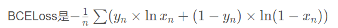
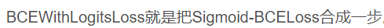
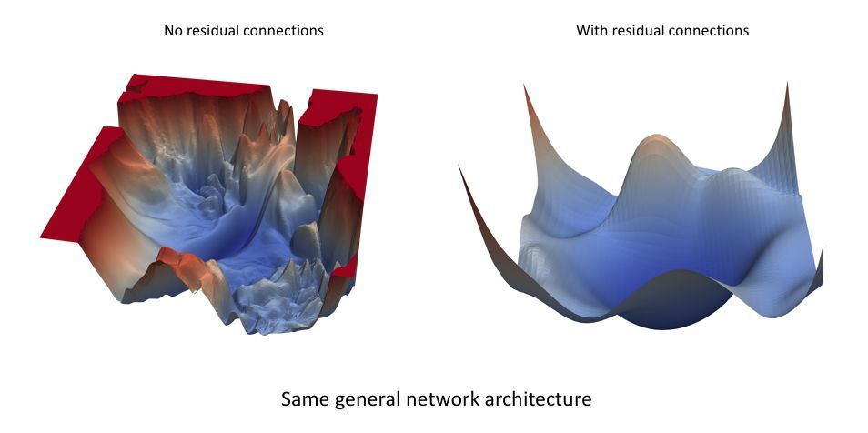
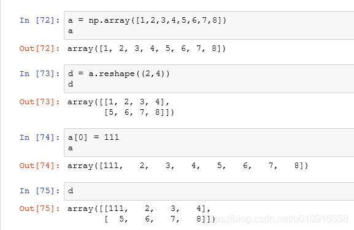
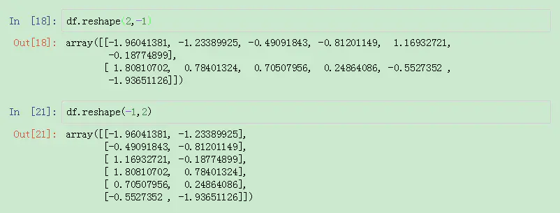

# 机器学习经验整理
(拒绝拖延!!!)

# 机器学习模型中的两类参数

一类需要从数据中学习和估计得到，称为模型参数（Parameter）---即模型本身的参数。比如，线性回归直线的加权系数（斜率）及其偏差项（截距）都是模型参数。
还有一类则是机器学习算法中的调优参数（tuning parameters），需要人为设定，称为超参数（Hyperparameter）。比如，正则化系数λ，决策树模型中树的深度。

# 参数和超参数的区别

模型参数是模型内部的配置变量，需要用数据估计模型参数的值  
模型超参数是模型外部的配置，需要手动设置超参数的值。  
超参数是在开始学习过程之前设置值的参数。 相反，其他参数的值通过训练得出。
机器学习中一直说的“调参”，实际上不是调“参数”，而是调“超参数”。

# 哪些属于超参数

梯度下降法中的学习速率α，迭代次数epoch，批量大小batch-size，k近邻法中的k（最相近的点的个数），决策树模型中树的深度，等等。

# torch.randn()

用来生成随机数字的tensor，这些随机数字满足标准正态分布（0~1）。
torch.randn（size),size可以是一个整数，也可以是一个元组。
代码示例：

```
import torch  
a=torch.randn(3)  
b=torch.randn(3,4)  
print("a:",a)  
print("b:",b)
```

```
a: tensor([ 0.9405, -0.1068,  0.1712])
b: tensor([[-1.0962, -0.1893,  1.2323,  0.5703],
        [-1.5256, -1.4923,  0.4275,  0.5143],
        [ 1.1200,  0.5317,  1.1961, -2.2533]])
```

# 计算机视觉模型库-Pytorch Image Models (timm)

"timm"是由Ross Wightman创建的深度学习库，是一个关于SOTA的计算机视觉模型、层、实用工具、optimizers, schedulers, data-loaders, augmentations，可以复现ImageNet训练结果的训练/验证代码。  
fastai的timm文档：https://fastai.github.io/timmdocs/

#jupyer的感叹号!用于执行来自操作系统的命令

# BCELoss和BCEWithLogitsLoss


BCEWithLogitsLoss函数包括了 Sigmoid 层和 BCELoss 层. 适用于多标签分类任务

CrossEntropyLoss函数 包含Softmax,层和 NLLLoss层,适用于单标签分类问题  

参考讲解：https://blog.csdn.net/qq_22210253/article/details/85222093

# k-交叉验证KFold

KFold 是 sklearn 包中用于交叉验证的函数。在机器学习中，样本量不充足时，通常使用交叉训练验证。  
参考讲解：https://www.cnblogs.com/loubin/p/11305565.html  

原理补充：  
>在机器学习建模过程中，通行的做法通常是将数据分为训练集和测试集。测试集是与训练独立的数据，完全不参与训练，用于最终模型的评估。在训练过程中，经常会出现过拟合的问题，就是模型可以很好的匹配训练数据，却不能很好在预测训练集外的数据。如果此时就使用测试数据来调整模型参数，就相当于在训练时已知部分测试数据的信息，会影响最终评估结果的准确性。通常的做法是在训练数据再中分出一部分做为验证(Validation)数据，用来评估模型的训练效果。

>验证数据取自训练数据，但不参与训练，这样可以相对客观的评估模型对于训练集之外数据的匹配程度。模型在验证数据中的评估常用的是交叉验证，又称循环验证。它将原始数据分成K组(K-Fold)，将每个子集数据分别做一次验证集，其余的K-1组子集数据作为训练集，这样会得到K个模型。这K个模型分别在验证集中评估结果，最后的误差MSE(Mean Squared Error)加和平均就得到交叉验证误差。交叉验证有效利用了有限的数据，并且评估结果能够尽可能接近模型在测试集上的表现，可以做为模型优化的指标使用。

**疑问解答:**

* 为什么不直接拆分训练集与数据集，来验证模型性能，反而采用多次划分的形式，岂不是太麻烦了？

> 我们为了防止在训练过程中，出现过拟合的问题，通行的做法通常是将数据分为训练集和测试集。测试集是与训练独立的数据，完全不参与训练，用于最终模型的评估。这样的直接划分会导致一个问题就是测试集不会参与训练，这样在小的数据集上会浪费掉这部分数据，无法使模型达到最优（数据决定了程性能上限，模型与算法会逼近这个上限）。但是我们又不能划分测试集，因为需要验证网络泛化性能。采用K-Fold 多次划分的形式就可以利用全部数据集。最后采用平均的方法合理表示模型性能。

* 为什么还要进行所有数据集重新训练，是否太浪费时间？

> 我们通过K-Fold 多次划分的形式进行训练是为了获取某个模型的性能指标，单一K-Fold训练的模型无法表示总体性能，但是我们可以通过K-Fold训练的训练记录下来较为优异的超参数，然后再以最优模型最优参数进行重新训练，将会取得更优结果。 也可以采取方法一的方式不再进行训练使用模型融合的方式。

# *args 与 **kwargs 的区别，两者都是 python 中的可变参数

*args 和**kwargs可以写成任意形式
*args 表示任何多个无名参数，它本质是一个 tuple
**kwargs 表示关键字参数，它本质上是一个 dict
如果同时使用 *args 和 **kwargs 时，必须 *args 参数列要在 **kwargs 之前。

```
>>>def fun(*args, **kwargs):
print('args=', args)
print('kwargs=', kwargs)
```

```
>>>fun(1, 2, 3, 4, A='a', B='b', C='c', D='d')
args= (1, 2, 3, 4)
kwargs= {'A': 'a', 'B': 'b', 'C': 'c', 'D': 'd'}
```

# KFlod取值问题

运用Kfold交叉验证时，在一个限度内k的值越大越好。因为k越大我们验证的次数就越多，最后取出来的平均数越能代表训练模型的准确度。

但是k是需要在一个限度之内的。k太大有两个坏处。

* 容易给机器造成过重负担，花费大量时间。
* 每一次验证的测试集（或验证集）中数据太少，很难得到准确的误报率。

总体而言，k一般取10，取值依不同项目情况而定，当然一定存在k<n（训练集数据条数）。

# 泛化能力
泛化能力（generalization ability）是指机器学习算法对新鲜样本的适应能力。学习的目的是学到隐含在数据背后的规律，对具有同一规律的学习集以外的数据，经过训练的网络也能给出合适的输出，该能力称为泛化能力。
大的batchsize导致模型泛化能力下降
大的batchsize减少训练时间，提高稳定性

# 残差的loss平滑的直观感受-论文《Visualizing the Loss Landscape of Neural Nets》
论文链接：[Visualizing the Loss Landscape of Neural Nets](paper/Visualizing the Loss Landscape of Neural Nets.pdf)  
github:https://github.com/tomgoldstein/loss-landscape

神经网络的损失函数地图（loss landscape）（下图所示）是网络参数值的函数，当在特定数据集上执行推断（预测）时量化与使用特定参数配置相关的「误差」。这个损失地图可能对于很相似的网络架构也看起来很不同。下图来自论文《Visualizing the Loss Landscape of Neural Nets》，其中展示了残差连接可产生更平滑的拓扑结构。



# KFold与StratifiedKFold
StratifiedKFold用法类似Kfold，但是他是分层采样，确保训练集，测试集中各类别样本的比例与原始数据集中相同。

KFold和StandardFold函数共有三个参数：

n_splits：默认为3，表示将数据划分为多少份，即k折交叉验证中的k；

shuffle：默认为False，表示是否需要打乱顺序，这个参数在很多的函数中都会涉及，如果设置为True，则会先打乱顺序再做划分，如果为False，会直接按照顺序做划分；

random_state：默认为None，表示随机数的种子，只有当shuffle设置为True的时候才会生效。

>from sklearn.model_selection import  StratifiedKFold,KFold

# 斯透奇斯规则(Sturges'rule)
组距分组时,根据数据个数n确定组数m的经验公式,直方图分组用这个比较河里，这很河里
统计学书中提到了一个帮助确定组数的经验公式：    
斯透奇斯规则(Sturges'rule),m=1+3.322lgN,(N为总次数)    


# 数据分箱之pd.cut()
pd.cut( x, bins, right=True, labels=None, retbins=False, precision=3, include_lowest=False, duplicates='raise', )

* x ： 一维数组（对应前边例子中提到的销售业绩）

* bins ：整数，标量序列或者间隔索引，是进行分组的依据，

>* 如果填入整数n，则表示将x中的数值分成等宽的n份（即每一组内的最大值与最小值之差约相等）；
>* 如果是标量序列，序列中的数值表示用来分档的分界值
>* 如果是间隔索引，“ bins”的间隔索引必须不重叠
* right ：布尔值，默认为True表示包含最右侧的数值

>* 当“ right = True”（默认值）时，则“ bins”=[1、2、3、4]表示（1,2]，（2,3],（3,4]
>* 当bins是一个间隔索引时，该参数被忽略。
* labels : 数组或布尔值，可选.指定分箱的标签

>* 如果是数组，长度要与分箱个数一致，比如“ bins”=[1、2、3、4]表示（1,2]，（2,3],（3,4]一共3个区间，则labels的长度也就是标签的个数也要是3
>* 如果为False，则仅返回分箱的整数指示符，即x中的数据在第几个箱子里
>* 当bins是间隔索引时，将忽略此参数
* retbins： 是否显示分箱的分界值。默认为False，当bins取整数时可以设置retbins=True以显示分界值，得到划分后的区间

* precision：整数，默认3，存储和显示分箱标签的精度。

* include_lowest：布尔值，表示区间的左边是开还是闭，默认为false，也就是不包含区间左边。

* duplicates：如果分箱临界值不唯一，则引发ValueError或丢弃非唯一
# reshape新生成数组和原数组公用一个内存，不管改变哪个都会互相影响。


numpy库官网的介绍，这里的-1被理解为unspecified value，意思是未指定为给定的。如果需要特定的行数，列数多少无所谓，只需要指定行数，那么列数直接用-1代替就行。

所以-1在这里应该可以理解为一个正整数通配符，它代替任何整数。


# 交叉验证详解
>重点：
>* N折交叉验证有两个用途：模型评估、模型选择。
>* N折交叉只是一种划分数据集的策略。想知道它的优势，可以拿它和传统划分数据集的方式进行比较。它可以避免固定划分数据集的局限性、特殊性，这个优势在小规模数据集上更明显。
>* 把这种策略用于划分训练集和测试集，就可以进行模型评估；   
   把这种策略用于划分训练集和验证集，就可以进行模型选择。
>* 不用N折交叉验证就不能进行模型评估和模型选择了吗？当然不是。只要有测试集，就能进行模型评估；只要有验证集，就能进行模型选择。所以N折交叉验证只是在做这两件事时的一种可选的优化手段。
>当用交叉验证进行模型选择时，可以从多种模型中选择出泛化能力最好的（即最不容易发生过拟合）的模型。从这个角度上讲，交叉验证是避免发生过拟合的手段。同样是解决过拟合的方法，交叉验证与正则化不同：交叉验证通过寻找最佳模型的方式来解决过拟合；而正则化则是通过约束参数的范数来解决过拟合。

当用交叉验证进行模型评估时，交叉验证不能解决过拟合问题，只能用来评估模型的performance。  
详细讲解：https://www.cnblogs.com/henuliulei/p/13686046.html

# 交叉验证如何取K值？
2017年的一项研究给出了另一种经验式的选择方法，研究见下面的论文，作者建议 

且保证 

 ，此处的n代表了数据量，d代表了特征数。  
来自Journal of Nonparametric Statistics的  
paper:[Multiple predicting K-fold cross-validation for model selection. Journal of Nonparametric Statistics](paper/Multiple predicting K-fold cross-validation for model selection.pdf)  
详细讲解：https://zhuanlan.zhihu.com/p/31924220
# 方差、协方差、标准差、均方差、均方根值、均方误差、均方根误差对比分析
详细讲解：https://blog.csdn.net/cqfdcw/article/details/78173839

# kaggle提供的tesla V100支持to_fp16
在kaggle的petfinder的竞赛中，提供的tesla V100支持native FP16 math

利用fp16 代替 fp32

优点：

1）TensorRT的FP16与FP32相比能有接近一倍的速度提升168，前提是GPU支持FP16（如最新的2070,2080,2080ti等）

2）减少显存。
缺点：
1） 会造成溢出

在日常使用过程中，常使用双混合精度训练

# 混合精度训练
解释: https://blog.csdn.net/u011808673/article/details/82112115  
paper:
[MIXED PRECISION TRAINING](paper/MIXED PRECISION TRAINING.pdf)

# 正则表达式中的“^“这个符号的一些思考
只要是"^“这个字符是在中括号”[]“中被使用的话就是表示字符类的否定，如果不是的话就是表示限定开头。我这里说的是直接在”[]“中使用，不包括嵌套使用。
其实也就是说”[]“代表的是一个字符集，”^"只有在字符集中才是反向字符集的意思。
详细讲解：https://blog.csdn.net/sufubo/article/details/50990684

# *重要学习率规划----周期性余弦退火的keras实现，fastai中使用良好
fastai里面如果不用learn.fit来实现周期性的余弦退火
下面是论文原地址和keras实现，后期我也会自己写一个  
paper: [DECOUPLED WEIGHT DECAY REGULARIZATION](paper/DECOUPLED WEIGHT DECAY REGULARIZATION.pdf)  
详细讲解讲解：https://blog.csdn.net/qq_38290475/article/details/103548680