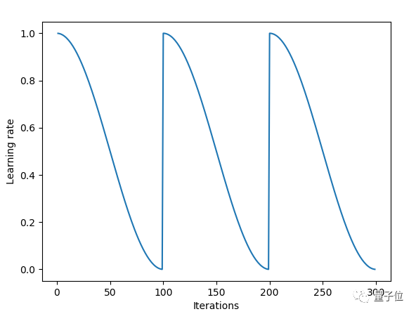
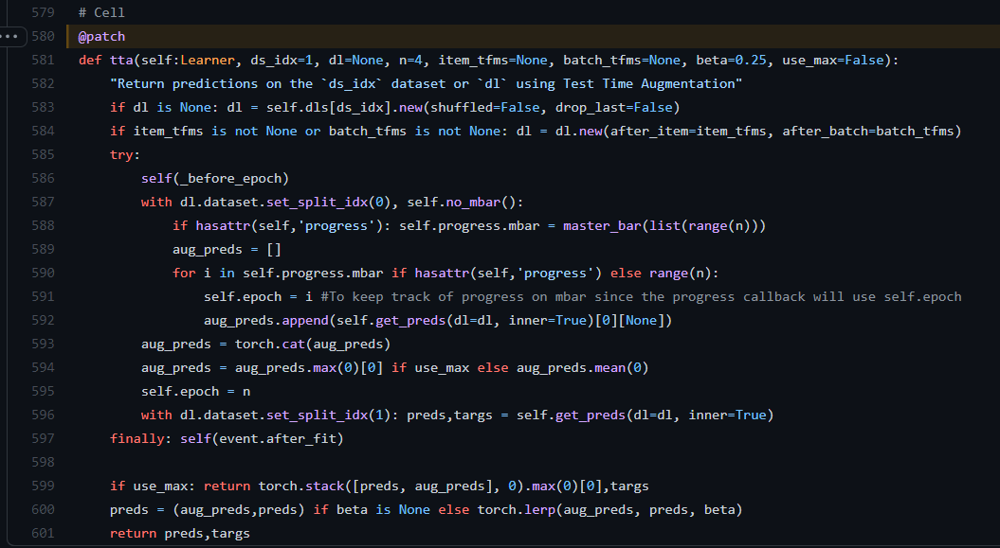

- [ install](#head1)
- [ Learn.fit_one_cycle(n_epoch)](#head2)
- [Learn.fit_one_cycle() 的重启的余弦退火-超参数调教明细表](#head3)
- [ ImageDataLoaders.from_df](#head4)
- [ learn.lr_find()学习率的选取怎样最好](#head5)
- [lr_find() 新的用法](#head6)
- [ learn.tta](#head7)
- [ OldRandomCrop](#head8)
- [ argmax(a)](#head9)
- [ AccumMetric的精确用法❤❤❤❤❤❤❤❤❤](#head10)
# <span id="head1"> install</span>
pip install fastai -i https://pypi.douban.com/simple

# <span id="head2"> Learn.fit_one_cycle(n_epoch)</span>
Fit self.model for n_epoch using the 1cycle policy.
在学习的过程中逐步增大学习率目的是为了不至于陷入局部最小值，边学习边计算loss。

其次，当loss曲线向上扬即变大的时候，开始减小学习率，慢慢的趋近梯度最小值，loss也会慢慢减小。就如下图：
图为课程中的图


该图x轴为迭代次数，y轴为学习率


该图x轴为迭代次数，y轴为loss

结合两个图可以看出：

学习率首先逐渐变大，loss逐渐变小
当学习率达到训练时给的参数时，开始下降。
随着学习率不断降低，loss也开始降低。
这个算法被称为:learning rate annealing(学习率退火算法)。

# <span id="head3">Learn.fit_one_cycle() 的重启的余弦退火-超参数调教明细表</span>
fastai开发文档的超参数明细表:https://docs.fast.ai/callback.schedule.html#ParamScheduler  
学习率在每个周期开始时重置为参数输入时的初始值，余弦退火部分描述的那样，逐渐减小

  
这个链接的东西非常好：但是经过实验，发现fit里面的cycle已经舍弃了
在fastai2 里面Learner.fit(n_epoch, lr=None, wd=None, cbs=None, reset_opt=False)
cbs我感觉是combine_schedes
https://blog.floydhub.com/ten-techniques-from-fast-ai/  
ps我找到了中文：  https://blog.csdn.net/weixin_42137700/article/details/81529789

-------------------更新-------------------  
fast.ai 不再推荐余弦退火，因为它不再是最高性能的通用学习率调度器。现在，这个荣誉属于单周期学习率调度器。
单周期学习速率调度器在2017年的论文 《Super-Convergence: Very Fast Training of Neural Networks Using Large Learning Rates》 中被引入。  
paper:[Super-Convergence: Very Fast Training of Neural Networks Using Large Learning Rates](../paper/SCVFTONNULLR.pdf)  
解释链接：https://bbs.cvmart.net/articles/4647/vote_count

# <span id="head4"> ImageDataLoaders.from_df</span>
`ImageDataLoaders.from_df(df, path='.', valid_pct=0.2, seed=None, fn_col=0, folder=None, suff='', label_col=1, label_delim=None, y_block=None, valid_col=None, item_tfms=None, batch_tfms=None, bs=64, val_bs=None, shuffle=True, device=None)`  
参考开发文档：https://docs.fast.ai/vision.data.html#ImageDataLoaders.from_df  
使用filename column和label column从df创建
如果标签列每一行包含多个标签，可以使用label_delim警告库您有一个多标签问题

# <span id="head5"> learn.lr_find()学习率的选取怎样最好</span>
在StackOverflow上找到了答案  
Anything between 0.5e-2 and 3e-2 has roughly the same slope and would be a reasonable choice
paper:[A disciplined approach to neural network hyper-parameters: Part 1 -- learning rate, batch size, momentum, and weight decay](paper/ADATNNHP.pdf)    
讲解链接：https://stackoverflow.com/questions/61172627/choosing-the-learning-rate-using-fastais-learn-lr-find  


# <span id="head6">lr_find() 新的用法</span>
```angular2html
learn = Learner(...) # any cnn_, tabular_, etc will work
lrs = learn.lr_find(suggest_funcs=(minimum, steep, valley, slide))
```
Valley and Slide can be used intermittently (or together as I’ll show in a moment!), but in general we found that: Valley > Slide > Steep > Minimum. Hence why the new default is valley.  

详细讲解：https://forums.fast.ai/t/new-lr-finder-output/89236  


# <span id="head7"> learn.tta</span>
Learner.tta(ds_idx=1, dl=None, n=4, item_tfms=None, batch_tfms=None, beta=0.25, use_max=False)
ds_idx=10 就是 dataloder[10]，它是个索引
dl是dataloder数据加载器
n是几次预测，经过n次预测，结果再平均
use_max如果是true就会获得所有预测的最大值
将beta设置为None以获得预测和tta结果的元组。
最终的预测是(1-beta)*average+ beta乘以通过数据集的转换获得的预测。

原式参数  
torch,lerp(input,end,weight，out=None)   
对两个张量以start, end做线性插值，将结果返回到输出张量  
out = start + weight*(end - start)  

torch.lerp(aug_preds, preds, beta)  

Return predictions on the ds_idx dataset or dl using Test Time Augmentation

In practice, we get the predictions n times with the transforms of the training set and average those. The final predictions are (1-beta) multiplied by this average + beta multiplied by the predictions obtained with the transforms of the dataset. Set beta to None to get a tuple of the predictions and tta results. You can also use the maximum of all predictions instead of an average by setting use_max=True.

If you want to use new transforms, you can pass them with item_tfms and batch_tfms.

# <span id="head8"> OldRandomCrop</span>
OldRandomCrop(size, pad_mode='zeros', enc=None, dec=None, split_idx=None, order=None) :: CropPad

随机裁剪并且填充0，相当于恢复

# <span id="head9"> argmax(a)</span>
取出a中元素最大值所对应的索引


# <span id="head10"> AccumMetric的精确用法❤❤❤❤❤❤❤❤❤</span>
```angular2html
AccumMetric(func, dim_argmax=None, activation='no', thresh=None, to_np=False, invert_arg=False, flatten=True, **kwargs) :: Metric
```
Stores predictions and targets on CPU in accumulate to perform final calculations with func.  
假如有5个折，每一折有10个epoch，那么在每一折中，计算损失是使用一个epoch的预测和目标来进行计算的，
在每次运行输出的时候，显示的是批分数，但是在最终训练好的时候，要的是rsme分数，这就会产生误差
真正的均方根误差，就应该是把所有的折的预测和误差最后一起进行计算，而不是每个折进行计算完单个折的均方根误差，然后在相加求均值  
```由于每个折叠都是 RMSE（均方根误差），您不能平均平方根并获得平方根。```  
使用这个函数可以将结果保存在cpu中，然后用func来进行计算，或者自己手动保存，最后进行计算。
将预测和目标存储在CPU中，以使用func执行最终计算。
kaggle大神讲解：https://www.kaggle.com/c/petfinder-pawpularity-score/discussion/293378#1607804  


# mixup
fastai的mixup真的好用
class MixUp[source]
MixUp(alpha=0.4) :: MixHandler
```angular2html
Learner(dls, nn.Linear(3,4), loss_func=CrossEntropyLossFlat(), cbs=mixup) as learn
```
Implementation of https://arxiv.org/abs/1710.09412  
开发文档：https://docs.fast.ai/callback.mixup.html#MixUp  
详细讲解:https://blog.csdn.net/ouyangfushu/article/details/87866579  

# learn.save和learn.export区别
Learner.save  
Save model and optimizer state (if with_opt) to self.path/self.model_dir/file  
用Learner.load读取

Learner.export  
Export the content of self without the items and the optimizer state for inference
The Learner is saved in self.path/fname, using pickle_protocol. Note that serialization in Python saves the names of functions, not the code itself. Therefore, any custom code you have for models, data transformation, loss function etc... should be put in a module that you will import in your training environment before exporting, and in your deployment environment before loading it.  
用load_learner读取

个人理解：  
前者可以保存参数，以便在别的程序中直接使用预测，  
后者没有保存参数，在加载这个模型之前要重新加载好模型、损失函数、数据变换等，用来进行迁移学习可以用这个  

